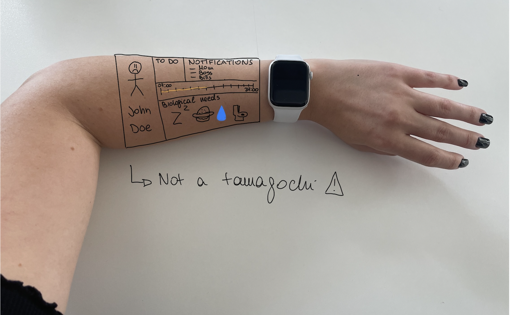

# ¿Que horas son mi corazon?

Based on photos of time picking activities inputs and people interviews about personal time management, I found 3 main categories of time committement for humans:

 * Biological (eat, sleep, poo time,...)
 * Imposed (work, school, traffic,...)
 * Choosed (hobbies, family, friends,...)

But how people choose to organise and feel their time? 

This wearable will allow relate two people through their daily activities and better understand what can affect others mental health.

  ## References
  * Title song of [Manu Chao](https://www.youtube.com/watch?v=RqDE20auDH8)
  * Observation [What do I do now](https://github.com/michelle-po/head-md-time-in-time-out/tree/main/process/What%20do%20I%20do%20now%3F)
  * Observation [People management of time](https://github.com/michelle-po/head-md-time-in-time-out/tree/main/process/People%20management%20of%20time)

