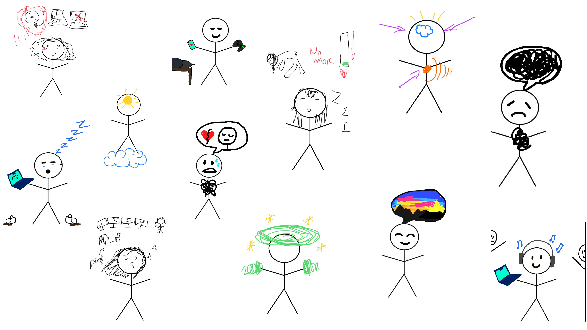

# Stressometer

There's a parallel world in which emotions are used as "skins" or wearable objects, where protagonists use them as skills to deal with daily commitments (biological, imposed or choosed) and their duration. 

The choice of the emotion to use in each appointment could affect characters mental health and happiness. But maybe, some combo of skins (emotions) could transforms themself into something unexpected and unpredictable: but this combo will you help you or stress you out?

The maximal goal will be to end the day with the minimal level of stress and emotional damages.

