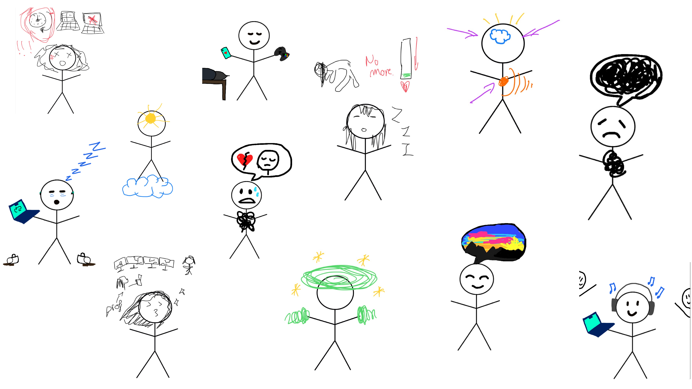

# 0-800-Stress line

"Do you feel anxious ? Do your busy days distress you?
Call the stress line. We will be able to fill you with positivity and make you forget your problems, life is good! Don't waste it being sad!"

The user of the wearable receive an help request from a person who is struggling with mental health. 

During the day, the user will give tips and help on how to use feelings and how to go on with stressful situations. In every help request of this misterious person, the user will decide between several options, but each of them will reveal the person identity and change the path of the story (for better or for worse). 

 

