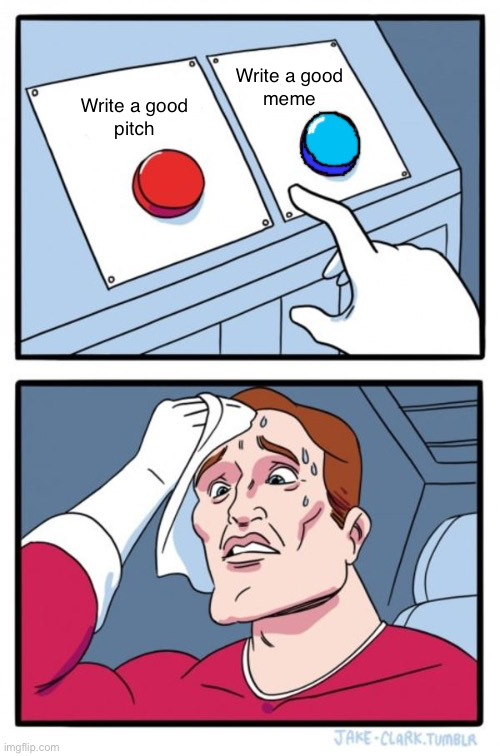

# 0-800-STRESS-LINE

"Do you feel anxious or stressed? Call the STRESS-LINE. We will fill your heart with positivity and make you forget your problems! Life is good, don't waste it being sad =)" 

On your wearable you receive a call from a person struggling with mental health. You need to quickly decide between several asnwers possibilities, in order to help resolve all problems as soon as possible.

Be careful: each choice you make may reveal the person identity, but potentially change the final of the story. Will you be able to really help before time runs out?

 

