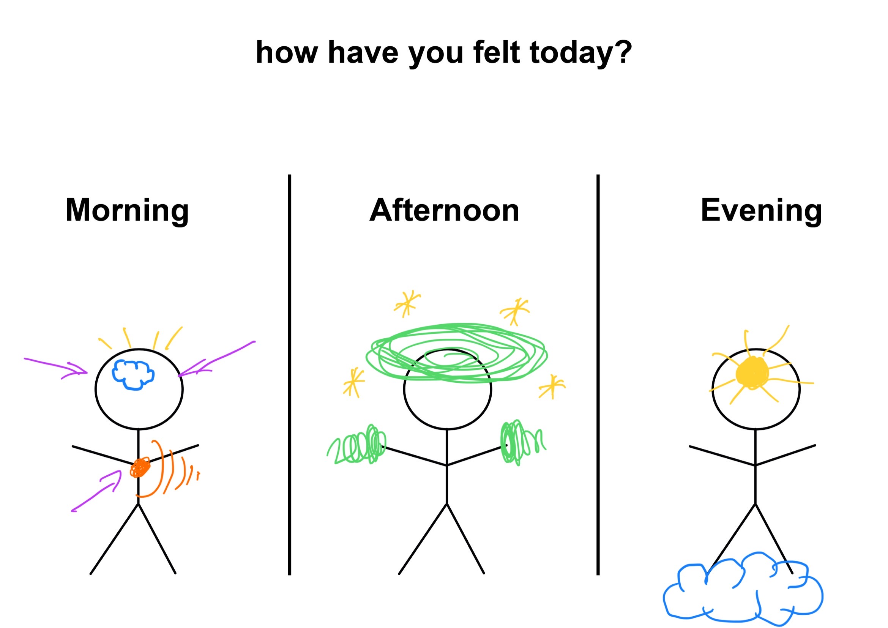

# How have you felt today?
 
## METHODOLOGY
In this analysis, I asked people in my circle of friends to draw their emotions during the same day. In order to have an equal starting point among all participants, I chose to provide a drawing template: 

## SAMPLING
 * **Subject:** 5 friends
 * **Duration:** 1 day (01.11.22)
 * **Context:** working day
 * **Tools:** drawing tools

## EXPECTED OUTPUT
 No great artistic skills are required for this exercise, but certainly imagination. I hope that not all participants just draw a facial expression, but it would be interesting to be able to understand bodily sensations. 
 
 In any case, it will be interesting to see the association of the emotion with the cause and how the dominant feelings may vary throughout the day. 

## RESULTS
Some answers were very basic, such as the description of tiredness as a feeling and the depiction of anxiety with a computer in hand and an unsmiling face. 

 ## CONCLUSION
Others, on the other hand, did not even draw the face, concentrating on the physical sensations, without needing to 'stereotype' the emotion. 

No one represented the same emotion twice in the same day. This clearly demonstrates the volatility and fragility of a feeling in relation to the environment and the people around us. 