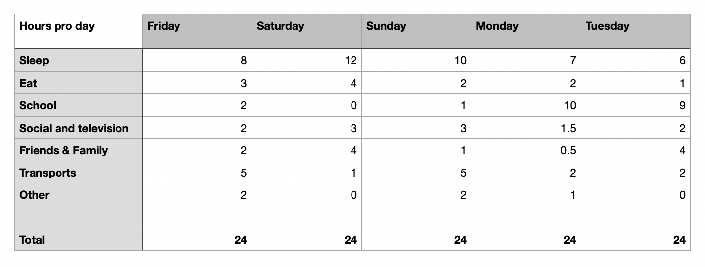
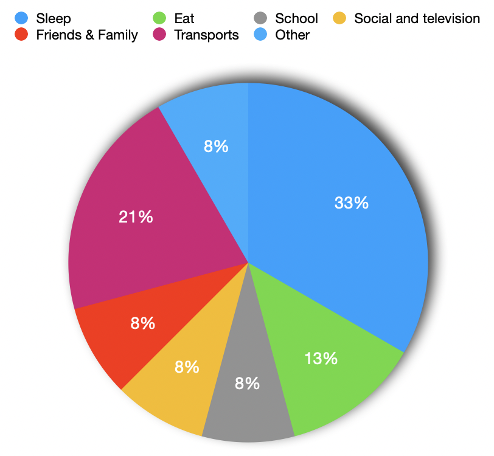
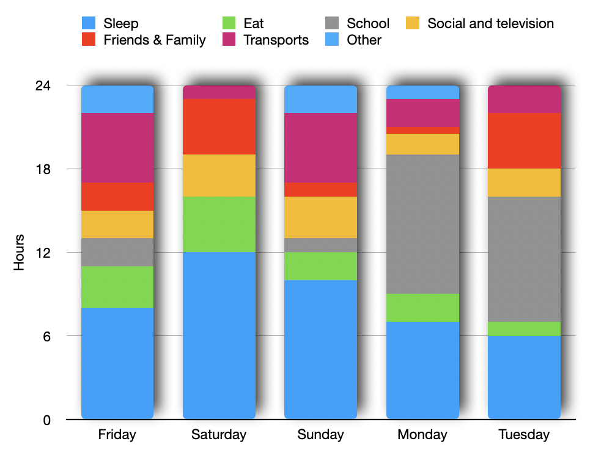

# MY TIME PIE
This exercise aims to highlight how the hours of the day are 'spent' in different activities for 5 days depending by personals rhithms and social activities of the subject. 

## METHODOLOGY
Each day the various activities and the duration of each one will be noted in a Excel table. All the data will be rounded to the nearest half-hour for simplification and more pleasant reading output.

## SAMPLING
 * Subject: Me
 * Duration: 5 days (Friday to Tuesday)
 * Context: Weekend visiting family in Ticino and dad birthday meal
 * Tools: Excel

## EXEPTED OUTPUT
The end result will be a pie chart with the percentages of the different activities over 5 days of collected data. This graph will highlight the major activities and give a little perspective on the subject's habits and lifestyle. 

## RESULTS
The categories of activities into which the day was divided are as follows:
* Sleep
* Eat
* School
* Social Networks and television (Media)
* Friends and Family
* Transports
* Other (Various commissions,not expeted actity,...)

**The data collection table:** 

 (Tuesday data are estimated on the day planned activities and agenda commitments)
 
 With this data, it is finally possible to create the five-day activity rate graph.     

**The time pie graphic:**  

The graph shows a high percentage of time spent sleeping, eating and in transport. The other activities are surprisingly equal in percentage terms. 

The results as predicted by the incipit of this exercise would be finished, but an interesting analysis would be the comparison of the percentages of the different days. 

**The time differences graphic:**  

This graph shows a clear difference in weekday activities compared to school days. In fact, at the weekend, transports (going to the family), sleep (no imposed wake-up calls in the morning), time spent with friends and family (more time available) and everything else related to leisure clearly increases and replaces the hours spent studying. 

 ## CONCLUSION

The comparison graph shows that the pie chart with the general percentages was not sufficient, that there is a story behind the data and that one cannot make a generalisation if one wants to make a deeper analysis.

Aspects for future improvement:
 * Categories not very accurate because is possible to do every others activities in transports too
 * Categories too larges for decompose activities
 * Time simplification